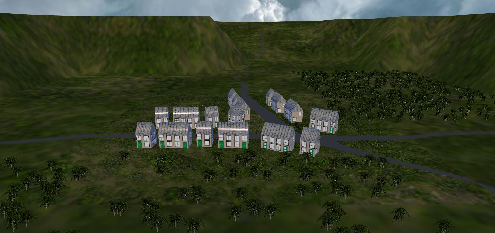
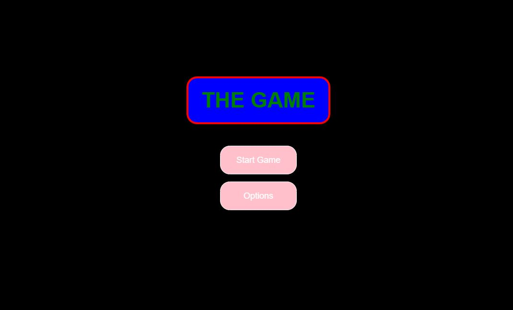
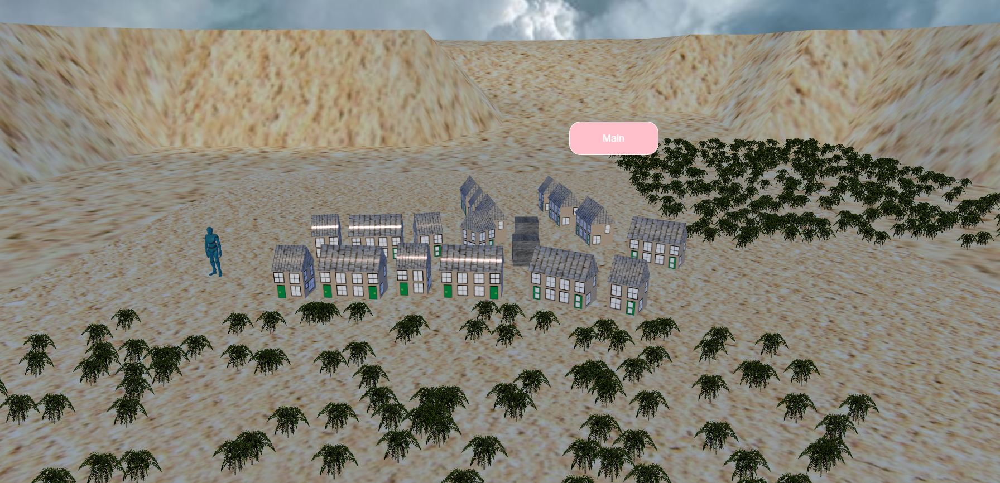

# Javascript Documentation
This document is about my 5th Scene/Element. Which is a combination of all of my classes. To describe this, I will be exsplaining how each element idividualy was implamented into the 5th one.

## Added Rotation scene
I added lighting and objects to my final scene which i learned from this scene.

### **Interface script**
```code
export interface SceneData {
    scene: Scene;
    torus: Mesh;
    box: Mesh;
    box2: Mesh;
    box3: Mesh;
    box4: Mesh;
    cone: Mesh;
    cone2: Mesh;
    cone3: Mesh;
    lightBulb: PointLight;
    lightDirectional?: DirectionalLight;
    lightSpot: SpotLight;
    lightHemispheric: HemisphericLight;
    sphere: Mesh;
    ground: Mesh;
    camera: Camera;
    shadowGenerator: ShadowGenerator;
  }
```
Starting with basics, typescript interface imports babylons object data and holds it for the scenes to pull the information from.


### **Run script objects**
```code
function createBox2(scene) {
  let box = MeshBuilder.CreateBox("box", scene);
  box.position.y = 6;
  box.position.x = -2.2;
  box.position.z = -2.2;
  
  return box;
}

export default function createStartScene(engine: Engine) {
  let scene = new Scene(engine);
  //Objects
  let box2 = createBox2(scene);
  let torus = createTorus(scene);
  let sphere = createSphere(scene);
  let cone = createCylinder(scene);

  let ground = createGround(scene);
  //lighting
  let lightHemispheric = createHemisphericLight(scene);
  //shadow and camara
  let camera = createArcRotateCamera(scene);
  let shadowGenerator = createShadows(lightDirectional, sphere, torus);

  let that: SceneData = {
    scene,
    box2,
    cone,
    torus,
    lightHemispheric,
    sphere,
    ground,
    camera,
    shadowGenerator,
  };
  return that;
}
```
In the Runscript, 'Create' object sets the information of the object the programmer wants in the scene. Which is called in the 'Create start scene' function to hold and create the information.


## Added colistion scene
From this scene I added the player object and the boxs with collition to my final scene.

### **Baked animation script**
```code
export class bakedAnimations {

  animating: Boolean = false;
  walkRange: Nullable<AnimationRange>;
  runRange: Nullable<AnimationRange>;
  leftRange: Nullable<AnimationRange>;
  rightRange: Nullable<AnimationRange>;
  idleRange: Nullable<AnimationRange>;
  animScene: Scene;
  animSkeleton: Skeleton;

  // constructor
  constructor(myscene: Scene, skeleton: Skeleton) {
    // use baked in animations
    this.animScene = myscene;
    this.animSkeleton = skeleton;
    this.animSkeleton.animationPropertiesOverride = new AnimationPropertiesOverride();
    this.animSkeleton.animationPropertiesOverride.enableBlending = true;
    this.animSkeleton.animationPropertiesOverride.blendingSpeed = 0.05;
    this.animSkeleton.animationPropertiesOverride.loopMode = 1;

    this.walkRange = skeleton.getAnimationRange("YBot_Walk");
    this.runRange = skeleton.getAnimationRange("YBot_Run");
    this.leftRange = skeleton.getAnimationRange("YBot_LeftStrafeWalk");
    this.rightRange = skeleton.getAnimationRange("YBot_RightStrafeWalk");
    this.idleRange = skeleton.getAnimationRange("YBot_Idle");
  }
```
The baked animation script holds the animations for the babylon player object, which are called in the Run Script

### **Run Script script**
```code
 runScene.player.then((result) => {
      let characterMoving: Boolean = false;
      let character: AbstractMesh = result!.meshes[0];
      //let character: TransformNode = getAggregate().body.transformNode;
      if (keyDownMap["w"] || keyDownMap["ArrowUp"]) {
        character.position.x -= 0.1;
        character.rotation.y = (3 * Math.PI) / 2;
        characterMoving = true;
      }
      if (keyDownMap["a"] || keyDownMap["ArrowLeft"]) {
        character.position.z -= 0.1;
        character.rotation.y = (2 * Math.PI) / 2;
        characterMoving = true;
      }
      if (keyDownMap["s"] || keyDownMap["ArrowDown"]) {
        character.position.x += 0.1;
        character.rotation.y = (1 * Math.PI) / 2;
        characterMoving = true;
      }
      if (keyDownMap["d"] || keyDownMap["ArrowRight"]) {
        character.position.z += 0.1;
        character.rotation.y = (0 * Math.PI) / 2;
        characterMoving = true;
      }

      if (getKeyDown() && characterMoving) {
        if (!move.getAnimating()) {
          move.walk();
          move.toggleAnimating();
        }
      } else {
        if (move.getAnimating()) {
          move.idle();
          move.toggleAnimating();
        }
      }
    });
  });
```
In the Runscript, the keybinds are set to call the animation and rotation when pressed.


## Added Village scene
I added the Villge scene to my final project and changed up the textures used.

### **Game Scene script**
function createTerrain(scene: Scene) {
  //Create large ground for valley environment
  const largeGroundMat = new StandardMaterial("largeGroundMat");
  largeGroundMat.diffuseTexture = new Texture(
    "./assets/environments/Sand.jpg"
  );

  const largeGround = MeshBuilder.CreateGroundFromHeightMap(
    "largeGround",
    "./assets/environments/villageheightmap.png",
    {
      width: 150,
      height: 150,
      subdivisions: 20,
      minHeight: 0,
      maxHeight: 10,
    },
    scene
  );
  largeGround.material = largeGroundMat;
  largeGround.position.y = -0.01;
}
The Village scene was used as a base for my final project while changeing the textures. While the size of the ground mesh was changed this is the script i played around the least with when building my final scene.


## Added GUI scene
With the GUI scene I tied it in with my Final project so that I could allow the GUI to be built in the scene to try makeing a button in final project to lead back to the GUI menu.

### **index.ts script**
```code
import { Engine} from "@babylonjs/core";
import menuScene from "./menuScene";
import gameScene from "./gameScene";
import "./main.css";

const CanvasName = "renderCanvas";

let canvas = document.createElement("canvas");
canvas.id = CanvasName;

canvas.classList.add("background-canvas");
document.body.appendChild(canvas);

let scene;
let scenes: any[] = [];

let eng = new Engine(canvas, true, {}, true);

scenes[0] = menuScene(eng);
scenes[1] = gameScene(eng);

scene = scenes[0].scene;
setSceneIndex(0);

export default function setSceneIndex(i: number) {
  eng.runRenderLoop(() => {
      scenes[i].scene.render();
  });
}   
```
This script handles the scene load when called. From here i can add as many scene's as I please aslong as their built.

### **Game Scene script**
```code
function createSceneButton(scene: Scene, name: string, index: string, x: string, y: string, advtex) {
  let button = GUI.Button.CreateSimpleButton(name, index);
      button.left = x;
      button.top = y;
      button.width = "160px";
      button.height = "60px";
      button.color = "white";
      button.cornerRadius = 20;
      button.background = "pink";

      const buttonClick = new Sound("MenuClickSFX", "./audio/menu-click.wav", scene, null, {
        loop: false,
        autoplay: false,
      });

      button.onPointerUpObservable.add(function() {
          console.log("THE BUTTON HAS BEEN CLICKED");
          buttonClick.play();
          setSceneIndex(0);
      });
      advtex.addControl(button);
      return button;
}
```
Createing a button in my scene I can call any scene I wish to be loaded, in this case this buttons calling the first scene which is the GUI menu.


## Final Project
Useing all of the above I made my final scene, incorparateing all that we had learned over the 1st semester. While there is much more I could of implamented, I am proud to have brought it all together.




<!--# codeing notes
Just setting up.

## Bit More

* hello 

*hello* 

**hello**

***hello***

List

1. item
2. item
3. item

* item
* item
* item

> CTRL + SHIFT + P

```code
Output Listing
import {} from "@babylonjs/core";

import { SceneData } from "./interfaces";
import "@babylonjs/loaders";

export default function createRunScene(runScene: SceneData) {
  runScene.scene.onAfterRenderObservable.add(() => {});
}
```

hello me
```html
<!DOCTYPE html>
<html>
    <head>
        <meta charset="UTF-8">
        <title>Houses scene</title>
    </head>
    <body> </body>
</html>
<script type="module" src="./src/index.ts"></script>
```

[Markdown notes](https://store.steampowered.com/app/1494420/Silica/)


